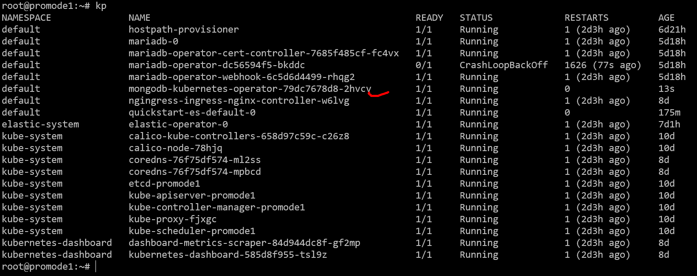
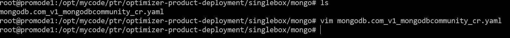
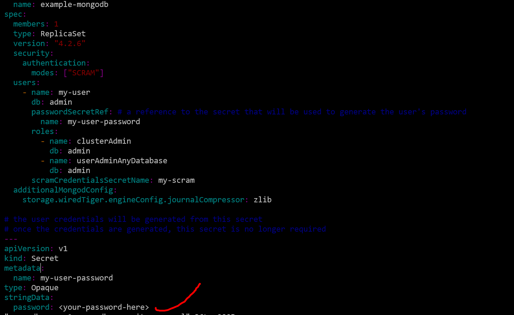
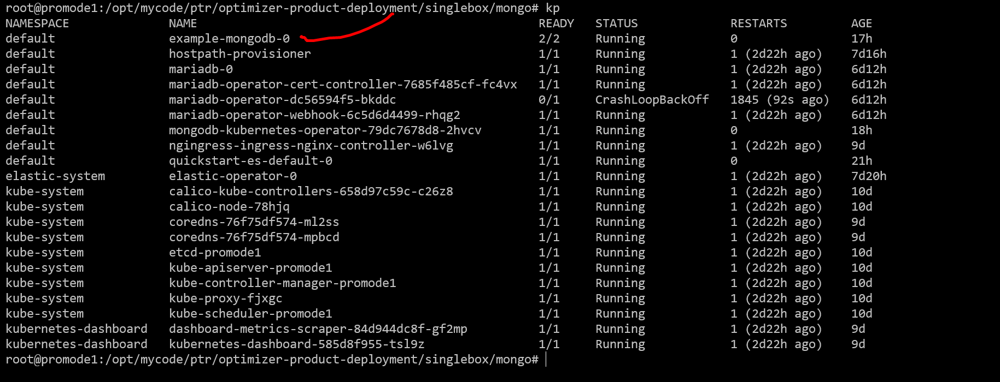
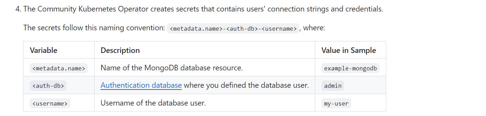
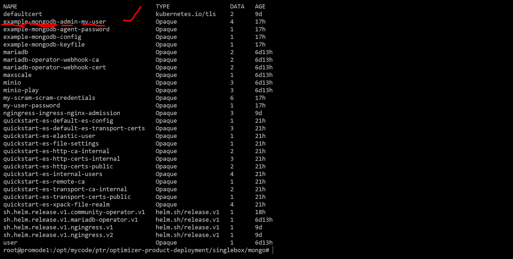
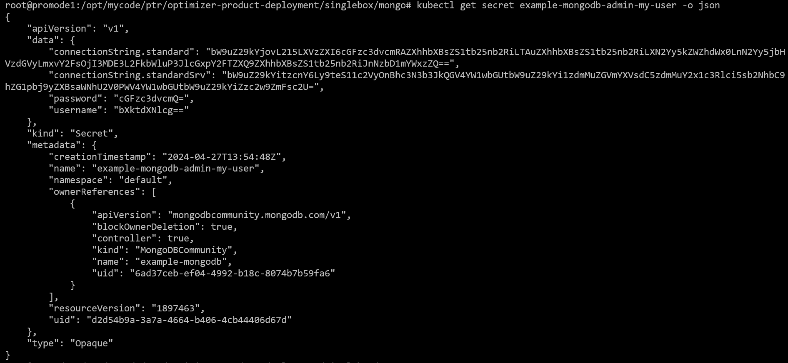
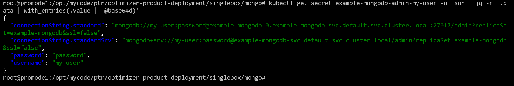

## install the mongo oprator
Add the MongoDB Helm Charts for Kubernetes repository to Helm by running the following command:
helm repo add mongodb https://mongodb.github.io/helm-charts

Deploy that operator
helm install community-operator mongodb/community-operator

if all goes well , operator will be installed as below:

## install the mongo instance
go to directory mongo
cd /opt/mycode/ptr/optimizer-product-deployment/singlebox/mongo

you will see a file as below:
mongodb.com_v1_mongodbcommunity_cr.yaml

Change the password that will act as admin password of mongo as below:

In the file , i used mongo version as 4.2.6 , that only works , the latest 6.0.5 dont work.

Now you can deploy the mongo instance 

kubectl apply -f mongodb.com_v1_mongodbcommunity_cr.yaml

If all goes well , you will see the mongo db instance will 

## How to use the database

You can see the secret as below

To get the values for connection 

The above values can be used to connect the database.

## Let us first install the mongosh client in local machine to connect db

### Import the public key used by the package management system

wget -qO- https://www.mongodb.org/static/pgp/server-7.0.asc | sudo tee /etc/apt/trusted.gpg.d/server-7.0.asc

### Create a list file for MongoDB

echo "deb [ arch=amd64,arm64 ] https://repo.mongodb.org/apt/ubuntu jammy/mongodb-org/7.0 multiverse" | sudo tee /etc/apt/sources.list.d/mongodb-org-7.0.list

### Reload local package database

sudo apt-get update

### Install mongosh client :
sudo apt-get install -y mongodb-mongosh

## Lets connect mongosh client with initial user my-user

mongosh --username my-user --authenticationDatabase admin --password=password

### connect admin authentication database 

use admin

### create a admin user with role root 
db.createUser(
  {
    user: "admin",
    pwd: "password",
    roles: [ { role: "root", db: "admin" } ]
  }
);
exit;

### login with admin user with role root 

mongosh --username admin --authenticationDatabase admin --password=password

### insert a record in collection 

db.myCollection.insertOne( { x: 1 } );

record get added properly

