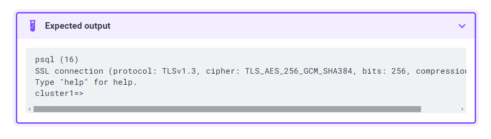
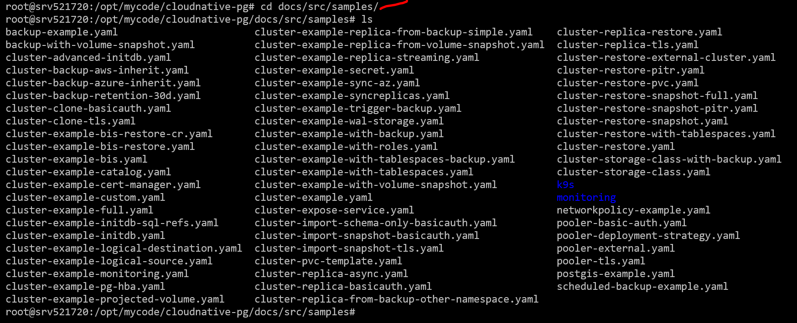

# install the PG through operator
There are many pg operator , i found that two operator works best:
1. CloudnativePG by Enterprisedb
https://github.com/cloudnative-pg/cloudnative-pg/blob/main/docs/src/quickstart.md

2. percona operator
Ref -- https://docs.percona.com/percona-operator-for-postgresql/2.0/kubectl.html

Note - finally i see that cloudnative operator works really good , so i switch to that !
========================================================
## Firstly let us install the stuffs by percona operator

## Create the Kubernetes namespace for your cluster

kubectl create namespace postgres-operator

## Deploy the Operator using  the following command:

kubectl apply --server-side -f https://raw.githubusercontent.com/percona/percona-postgresql-operator/v2.3.1/deploy/bundle.yaml -n postgres-operator

## Deploy Percona Distribution for PostgreSQL cluster:

kubectl apply -f https://raw.githubusercontent.com/percona/percona-postgresql-operator/v2.3.1/deploy/cr.yaml -n postgres-operator

## Check the Operator and replica set Pods status.

kubectl get pg -n postgres-operator

## Connect to the PostgreSQL cluster

The pgBouncer  component of Percona Distribution for PostgreSQL provides the point of entry to the PostgreSQL cluster. We will use the pgBouncer URI to connect.

The pgBouncer URI is stored in the Secret  object, which the Operator generates during the installation.

To connect to PostgreSQL, do the following:

List the Secrets objects

$ kubectl get secrets -n <namespace>
The Secrets object we target is named as <cluster_name>-pguser-<cluster_name>. The <cluster_name> value is the name of your Percona Distribution for PostgreSQL Cluster. The default variant is: cluster1-pguser-cluster1

PGBOUNCER_URI=$(kubectl get secret <secret> --namespace <namespace> -o jsonpath='{.data.pgbouncer-uri}' | base64 --decode)

kubectl run -i --rm --tty pg-client --image=perconalab/percona-distribution-postgresql:16 --restart=Never -- psql $PGBOUNCER_URI

Expected outout will be like as below:

=====================================================================================
# How to install by CloudNative Operator 
## install the operator

kubectl apply --server-side -f \
  https://raw.githubusercontent.com/cloudnative-pg/cloudnative-pg/release-1.23/releases/cnpg-1.23.1.yaml

You can verify that with:

kubectl get deployment -n cnpg-system cnpg-controller-manager

## Now deploy a simple cluster 

kubectl apply -f - <<EOF
---
apiVersion: postgresql.cnpg.io/v1
kind: Cluster
metadata:
  name: cluster-with-metrics
spec:
  instances: 3

  storage:
    size: 1Gi

  monitoring:
    enablePodMonitor: true
EOF

You will get lot of sample clsuter definitions in 
https://github.com/cloudnative-pg/cloudnative-pg

/docs/src/samples

