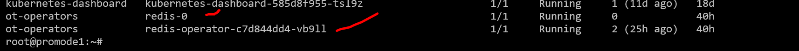

## How to install redis db with operator
ref - https://github.com/OT-CONTAINER-KIT/redis-operator/tree/master

We have installed the above operator and found it working and so writing the steps

## Add the helm chart

helm repo add ot-helm https://ot-container-kit.github.io/helm-charts/

## Deploy the redis-operator

helm upgrade redis-operator ot-helm/redis-operator \
  --install --create-namespace --namespace ot-operators

## After deployment, verify the installation of operator

helm test redis-operator --namespace ot-operators

## Create redis standalone setup

helm upgrade redis ot-helm/redis \
  --install --namespace ot-operators

If all goes all , u will see operator and instance is runnig as below:

