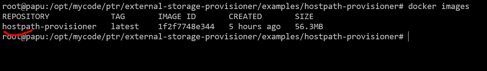
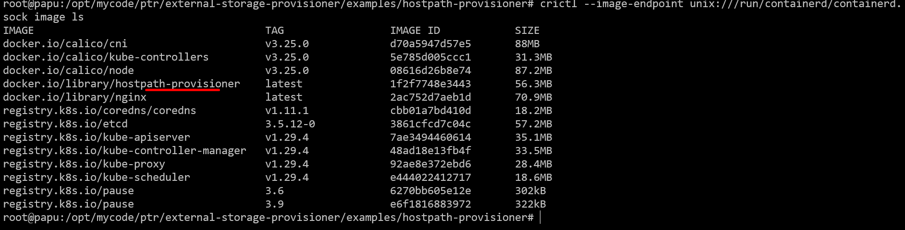
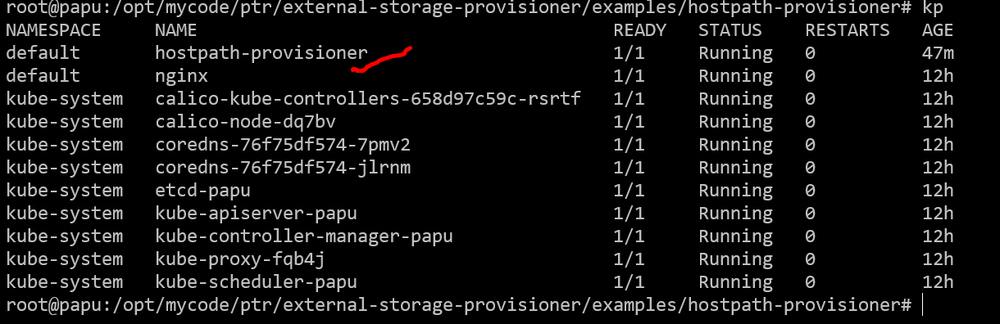
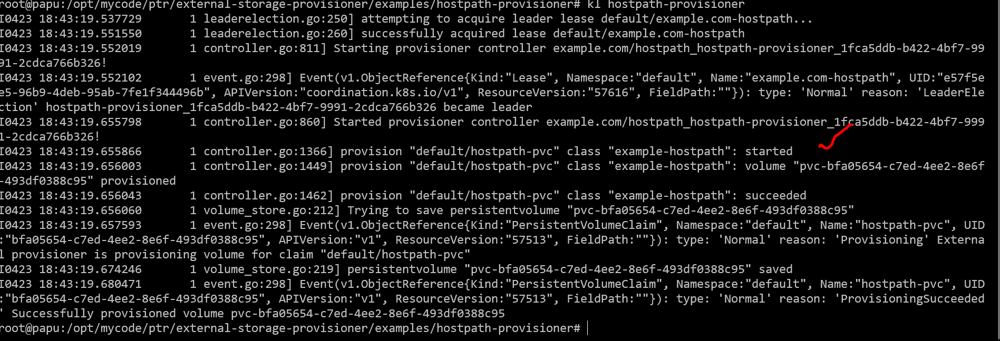
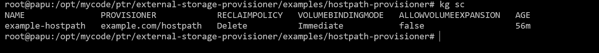
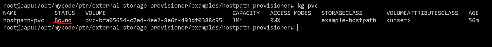
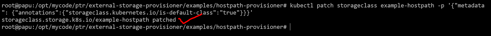
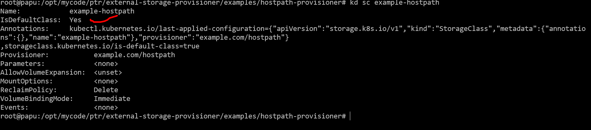

# How to provision the storage provisioner in k8 cluster

## Prerequisite

## Install Golang

We need to install the golang package in the machine environment to build the storage provisioner and configure in the cluster.

 wget https://go.dev/dl/go1.22.2.linux-amd64.tar.gz
 rm -rf /usr/local/go && tar -C /usr/local -xzf go1.22.2.linux-amd64.tar.gz
 export PATH=$PATH:/usr/local/go/bin
 Add path in ~/.bashrc and finally source the .bashrc file

## Install the docker as follows:
sudo apt-get install docker-ce docker-ce-cli containerd.io docker-buildx-plugin docker-compose-plugin

## install the provisioner

### build it

clone the provisioner :
git clone https://github.com/ptrsoft/external-storage-provisioner.git

goto to external-storage-provisioner/examples/hostpath-provisioner directory
cd external-storage-provisioner/examples/hostpath-provisioner
do build as follows:
root@papu:/opt/mycode/ptr/external-storage-provisioner/examples/hostpath-provisioner# make

This make will build the hostpath-provisioner docker image as shown below:

K8 dont see the docker images , so we need to import that in k8 as follows:

docker save hostpath-provisioner:latest -o hostpath-provisioner.tar
ctr -n=k8s.io images import hostpath-provisioner.tar

Then if you check the k8 images , you can see that as follows:

crictl --image-endpoint unix:///run/containerd/containerd.sock image ls

## Install the provisioner 

goto to following directory :

cd external-storage-provisioner/examples/hostpath-provisioner

### install the rbac controls that provisioner service can access as follows:
kubectl apply -f rbac.yaml
### install the pod that act as external provisioner
kubectl apply -f pod.yaml

If all works all , you should see the POD running

You should check the provisioner podlog as below:

If all goes well , you should see the message like started.

### now create storage class and volume as follows:
kubectl apply -f class.yaml
kubectl apply -f claim.yaml

## check storage class and volmes and the status

The above , volume bind should happen correctly.

## To make this storage class as default:
kubectl patch storageclass example-hostpath -p '{"metadata": {"annotations":{"storageclass.kubernetes.io/is-default-class":"true"}}}'

