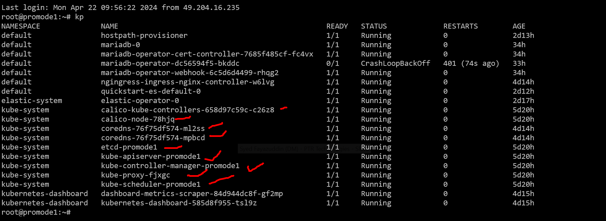

<!-- TOC -->

- [Install Containerd Runtime all nodes](#install-containerd-runtime-all-nodes)
    - [install dependencies](#install-dependencies)
    - [Enable the Docker repository](#enable-the-docker-repository)
    - [Update the package list and install containerd:](#update-the-package-list-and-install-containerd)
    - [Configure containerd to start using systemd as cgroup:](#configure-containerd-to-start-using-systemd-as-cgroup)
    - [Load the required kernel modules on all nodes](#load-the-required-kernel-modules-on-all-nodes)
    - [Restart and enable the containerd service:](#restart-and-enable-the-containerd-service)
- [Install K8](#install-k8)
    - [Do some prerequisiste](#do-some-prerequisiste)
    - [disable swap](#disable-swap)
    - [Configure the critical kernel parameters for Kubernetes using the following:](#configure-the-critical-kernel-parameters-for-kubernetes-using-the-following)
    - [Then, reload the changes](#then-reload-the-changes)
    - [Add Apt Repository for Kubernetes all nodes](#add-apt-repository-for-kubernetes-all-nodes)
    - [Install Kubectl, Kubeadm, and Kubelet all nodes](#install-kubectl-kubeadm-and-kubelet-all-nodes)
    - [Initialize Kubernetes Cluster with Kubeadm master node](#initialize-kubernetes-cluster-with-kubeadm-master-node)
    - [Run the following commands on the master node](#run-the-following-commands-on-the-master-node)
    - [Next, use kubectl commands to check the cluster and node status](#next-use-kubectl-commands-to-check-the-cluster-and-node-status)
    - [Add Worker Nodes to the Cluster worker nodes](#add-worker-nodes-to-the-cluster-worker-nodes)
    - [Install Kubernetes Network Plugin master node](#install-kubernetes-network-plugin-master-node)
    - [Verify the cluster and test master node](#verify-the-cluster-and-test-master-node)
    - [Deploy test application on cluster master node](#deploy-test-application-on-cluster-master-node)
    - [How to run pods in master node](#how-to-run-pods-in-master-node)
    - [To run as root](#to-run-as-root)
    - [How to check all stuffs are properly installed](#how-to-check-all-stuffs-are-properly-installed)
    - [How to configure the installed kubernetes](#how-to-configure-the-installed-kubernetes)
- [Some extra tips -](#some-extra-tips--)
    - [How to add aliases so that you can run command faster](#how-to-add-aliases-so-that-you-can-run-command-faster)
    - [How to export docker images to crictl discovered image](#how-to-export-docker-images-to-crictl-discovered-image)
    - [How to debug the service](#how-to-debug-the-service)
    - [How to clean the service](#how-to-clean-the-service)

<!-- /TOC -->
  - [Do some prerequisiste](#do-some-prerequisiste)
  - [disable swap](#disable-swap)
  - [Configure the critical kernel parameters for Kubernetes using the following:](#configure-the-critical-kernel-parameters-for-kubernetes-using-the-following)
  - [Then, reload the changes](#then-reload-the-changes)
  - [Add Apt Repository for Kubernetes (all nodes)](#add-apt-repository-for-kubernetes-all-nodes)
  - [Install Kubectl, Kubeadm, and Kubelet (all nodes)](#install-kubectl-kubeadm-and-kubelet-all-nodes)
  - [Initialize Kubernetes Cluster with Kubeadm (master node)](#initialize-kubernetes-cluster-with-kubeadm-master-node)
  - [Run the following commands on the master node](#run-the-following-commands-on-the-master-node)
  - [Next, use kubectl commands to check the cluster and node status](#next-use-kubectl-commands-to-check-the-cluster-and-node-status)
  - [Add Worker Nodes to the Cluster (worker nodes)](#add-worker-nodes-to-the-cluster-worker-nodes)
  - [Install Kubernetes Network Plugin (master node)](#install-kubernetes-network-plugin-master-node)
  - [Verify the cluster and test (master node)](#verify-the-cluster-and-test-master-node)
  - [Deploy test application on cluster (master node)](#deploy-test-application-on-cluster-master-node)
  - [How to run pods in master node](#how-to-run-pods-in-master-node)
  - [To run as root](#to-run-as-root)
  - [How to check all stuffs are properly installed](#how-to-check-all-stuffs-are-properly-installed)
- [Some extra tips -](#some-extra-tips--)
  - [How to add aliases so that you can run command faster](#how-to-add-aliases-so-that-you-can-run-command-faster)
  - [How to export docker images to crictl discovered image](#how-to-export-docker-images-to-crictl-discovered-image)
  - [How to debug the service](#how-to-debug-the-service)


# Install Containerd Runtime (all nodes)

## install dependencies

sudo apt install -y curl gnupg2 software-properties-common apt-transport-https ca-certificates

## Enable the Docker repository

sudo curl -fsSL https://download.docker.com/linux/ubuntu/gpg | sudo gpg --dearmour -o /etc/apt/trusted.gpg.d/docker.gpg
sudo add-apt-repository "deb [arch=amd64] https://download.docker.com/linux/ubuntu $(lsb_release -cs) stable"

## Update the package list and install containerd:

sudo apt update
sudo apt install -y containerd.io

## Configure containerd to start using systemd as cgroup:
containerd config default | sudo tee /etc/containerd/config.toml >/dev/null 2>&1
sudo sed -i 's/SystemdCgroup \= false/SystemdCgroup \= true/g' /etc/containerd/config.toml


## Load the required kernel modules on all nodes

sudo tee /etc/modules-load.d/containerd.conf <<EOF
overlay
br_netfilter
EOF
sudo modprobe overlay
sudo modprobe br_netfilter

## Restart and enable the containerd service:

sudo systemctl restart containerd
sudo systemctl enable containerd

That completes the conatinerd runtime install, that is used by k8.

Now you can go ahead and install the k8 as follows:

# Install K8

## Do some prerequisiste

## disable swap
sudo swapoff -a
sudo sed -i '/ swap / s/^\(.*\)$/#\1/g' /etc/fstab

## Configure the critical kernel parameters for Kubernetes using the following:

sudo tee /etc/sysctl.d/kubernetes.conf <<EOF
net.bridge.bridge-nf-call-ip6tables = 1
net.bridge.bridge-nf-call-iptables = 1
net.ipv4.ip_forward = 1
EOF

## Then, reload the changes

sudo sysctl --system

## Add Apt Repository for Kubernetes (all nodes)
//the following 2 is not working-
//papu - option 3 is preferred way to do , it works best

option1 
curl -s https://packages.cloud.google.com/apt/doc/apt-key.gpg | sudo gpg --dearmour -o /etc/apt/trusted.gpg.d/kubernetes-xenial.gpg
sudo apt-add-repository "deb http://apt.kubernetes.io/ kubernetes-xenial main"

option2
curl -fsSL https://packages.cloud.google.com/apt/doc/apt-key.gpg | sudo gpg --dearmor -o /etc/apt/keyrings/kubernetes.gpg

echo "deb [arch=amd64 signed-by=/etc/apt/keyrings/kubernetes.gpg] http://apt.kubernetes.io/ kubernetes-xenial main" | sudo tee -a /etc/apt/sources.list

Option 3
curl -fsSL https://pkgs.k8s.io/core:/stable:/v1.29/deb/Release.key | sudo gpg --dearmor -o /etc/apt/keyrings/kubernetes-apt-keyring.gpg

echo 'deb [signed-by=/etc/apt/keyrings/kubernetes-apt-keyring.gpg] https://pkgs.k8s.io/core:/stable:/v1.29/deb/ /' | sudo tee /etc/apt/sources.list.d/kubernetes.list

## Install Kubectl, Kubeadm, and Kubelet (all nodes)

sudo apt update
sudo apt install -y kubelet kubeadm kubectl
sudo apt-mark hold kubelet kubeadm kubectl

## Initialize Kubernetes Cluster with Kubeadm (master node)

sudo kubeadm  init --upload-certs

## Run the following commands on the master node
mkdir -p $HOME/.kube
sudo cp -i /etc/kubernetes/admin.conf $HOME/.kube/config
sudo chown $(id -u):$(id -g) $HOME/.kube/config

## Next, use kubectl commands to check the cluster and node status

kubectl get nodes

## Add Worker Nodes to the Cluster (worker nodes)
// papu - there is no need for this step as long as you decide to install it in a single box
// please ask me before u proceed with a multinode

kubeadm join 146.190.135.86:6443 --token f1h95l.u4nkex9cw8d0g63w         --discovery-token-ca-cert-hash sha256:6d15f2a79bdb38d1666af50c85f060b9fadc73f13c932e0e2a9eeef08f51f91a

## Install Kubernetes Network Plugin (master node)
//papu - unless this is done , the control plane never gets ready

kubectl apply -f https://raw.githubusercontent.com/projectcalico/calico/v3.25.0/manifests/calico.yaml

## Verify the cluster and test (master node)

kubectl get pods -n kube-system
kubectl get nodes

## Deploy test application on cluster (master node)

kubectl run nginx --image=nginx

## How to run pods in master node 
You can taint the master node
(myproject) papu@papu:~$ kubectl get no
NAME   STATUS   ROLES           AGE   VERSION
papu   Ready    control-plane   19h   v1.28.2

kubectl taint nodes --all node-role.kubernetes.io/control-plane-

## To run as root
export KUBECONFIG=/etc/kubernetes/admin.conf

## How to check all stuffs are properly installed 
//papu - when you see all the core services running perfectly ok




## How to configure the installed kubernetes 

After installing the kubernetes, we need to configure the certificate structure and nginx controller so that services like tekton can create ingress and they can be accessed via the ingress controller.

run the ansible script

ansible-playbook -vv -e "ansible_ssh_user=papu"  -e "ansible_connection=local"  -i "localhost," ansible/test.yaml

# Some extra tips -

## How to add aliases so that you can run command faster

alias k='kubectl'
alias kl='kubectl logs'
alias kdd='kubectl delete'
alias ke='kubectl edit'
alias kg='kubectl get'
alias kd='kubectl describe'
alias kp='kubectl get po --all-namespaces'

add the above aliases in your ~/.bashrc file so that you can use command faster


## How to export docker images to crictl discovered image

crictl --image-endpoint unix:///run/containerd/containerd.sock image ls
crictl --image-endpoint  unix:///run/containerd/containerd.sock rmi docker.io/library/hostpath-provisioner
docker save image -o image.tar
ctr -n=k8s.io images import image.tar

## How to debug the service

Run a busybox for debug
kubectl run -i --tty --rm debug --image=busybox --restart=Never -- sh
use netcat tools etc for connecting service

## How to clean the service

Step 1: Delete All Kubernetes Resources

Before uninstalling Kubernetes, ensure that you delete all resources (like pods, services, and volumes) that were created under Kubernetes.

```
kubectl delete all --all-namespaces --all

```

Step 2: Uninstall kubeadm, kubectl, and kubelet

Use the following commands to uninstall kubeadm, kubectl, and kubelet:

```
sudo apt-get purge kubeadm kubectl kubelet kubernetes-cni kube*   
sudo apt-get autoremove  

```
Step 3: Remove Configuration and Data

After uninstalling the Kubernetes components, ensure you remove all configurations and data related to Kubernetes:

```
sudo rm -rf ~/.kube
sudo rm -rf /etc/cni
sudo rm -rf /etc/kubernetes
sudo rm -rf /var/lib/etcd
sudo rm -rf /var/lib/kubelet

```
Step 4: Reset iptables

Reset the iptables rules to their default settings:

```
sudo iptables -F && sudo iptables -t nat -F && sudo iptables -t mangle -F && sudo iptables -X

```


